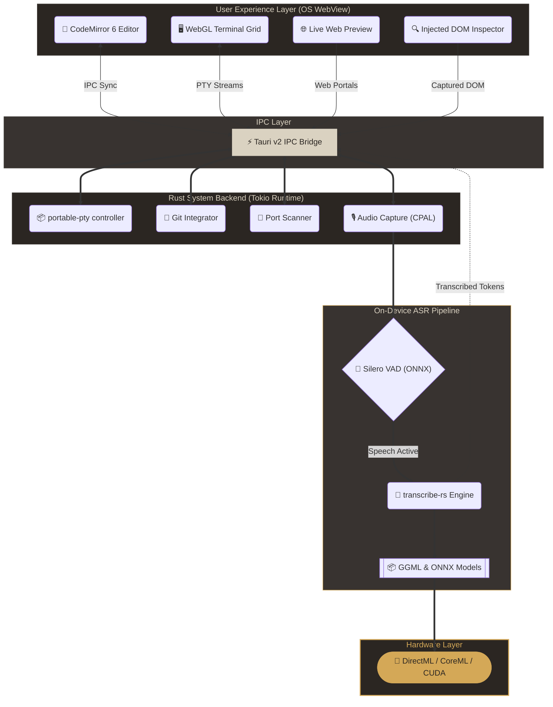

<div align="center">
  

  # Fit

  ### **The Ultra-Lightweight, AI-Ready Development Workspace**

  [](LICENSE)
  [](#)
  [](https://tauri.app/)
  [](https://react.dev/)
  [](#)
  [](#)

  <br />

  <p align="center">
    <i>Reclaim your system resources. Experience development at the speed of thought.</i>
  </p>
</div>

---

## The Performance Compromise is Over

Modern IDEs consume hundreds of megabytes of memory before you type your first line of code. They ship bloated copies of Chromium and Node.js to render static text, leaving your system starved for compilation, containers, and test suites.

**Fit is a new approach to the developer workspace.**

Built on Tauri 2.0 and Rust, Fit replaces browser-level overhead with native operating system rendering, shrinking the idle footprint to **~10 MB RAM**. 

By coupling an asynchronous Rust core with a React 19 interface, Fit delivers a single-window workstation with built-in terminals, Git integration, live preview, and fully local voice-to-code dictation.

---

## 🏗️ Architectural Overview




---

## 🚀 Efficiency Comparison

Fit leverages system-level webviews instead of embedding custom browser engines, reducing resource waste.

| Parameter | Fit | Traditional Electron IDEs | Legacy CLI Editors |
| :--- | :--- | :--- | :--- |
| **Idle Memory** | **~10 MB** | 300 MB – 1 GB+ | 15 MB – 50 MB |
| **Startup Time** | **< 100ms** | 2 – 5+ seconds | < 50ms |
| **Engine Core** | Native WebView | Embedded Chromium | Custom Terminal UI |
| **Voice Dictation** | **On-Device ONNX** | Cloud API or None | None |
| **Terminal Grid** | **WebGL (xterm.js)** | Software Canvas | Subshell Spawn |
| **Live Server Preview** | **Integrated Host Scanner** | External Web Browser | Shell Redirect |

---

## 🛠️ Main Modules

### 🎙️ On-Device Voice-to-Code
Write code hands-free without sending your voice data to external servers.
*   **VAD Gating:** Local Silero Voice Activity Detection (VAD) monitors microphone input in real-time, executing inference only when active speech is detected to save CPU cycles.
*   **Hardware Inference:** Local ONNX speech-to-text models process audio on device, using Windows DirectML (DirectX 12 GPUs), macOS CoreML, or CPU/CUDA.
*   **Model Selection:** Swap engines (Whisper, Moonshine, SenseVoice, Canary, Parakeet) through the settings panel to balance accuracy and system load.


### 🖥️ Hardware-Accelerated Terminal Grid
Run shell environments side-by-side with minimal latency.
*   **WebGL Renderer:** Terminal views utilize `xterm.js` WebGL and Canvas addons, removing lag during large output commands.
*   **Process Isolation:** Spawns sub-shells (PowerShell, WSL, Bash, Zsh) using the Rust `portable-pty` library, executing them on background `tokio` thread pools.
*   **Dynamic Grid:** Split, resize, and close terminal instances through a responsive layout controller.

### 📂 Version Control & Workspace Editor
Manage changes and edit code in a single window.
*   **CodeMirror 6 Editor:** Fast editing with instant syntax highlighting for Rust, TypeScript, Python, and Markdown. Sychronizes automatically with filesystem events.
*   **Git Interface:** Inspect untracked and modified files, stage changes, commit, and pull/push directly from the workspace pane.
*   **Side-by-Side Visual Diff:** Compare local changes against target branches before staging.

### 🌐 Live Preview & DOM Inspector
Preview web layouts and debug elements without switching windows.
*   **Automatic Server Discovery:** Monitors localhost ports and loads active development environments (Vite, Next.js, Webpack) inside an integrated preview frame.
*   **Frame Injection:** Injects a lightweight debugger script into the active preview frame. When active, clicking elements displays their source structure and lets you copy or target them.

---

## ⚙️ Technical Under the Hood

### Zero-Bloat Runtime
Tauri 2.0 acts as a lightweight wrapper, calling the operating system's native web view (WebView2 on Windows, WebKit on macOS/Linux). As a result, Fit bypasses the Chromium load phase, cutting file distribution size and startup latency.

### Async Rust Engine
Heavy actions (running PTY subprocesses, polling git history, scanning ports, and managing models) are offloaded to background threads. This keeps the rendering thread responsive at 60 FPS.

### Build Optimization
Fit is compiled using optimization profiles that reduce binary size and memory allocation:

```toml
# src-tauri/Cargo.toml
[profile.release]
panic = "abort"      # Disables stack unwinding to reduce binary footprint
codegen-units = 1    # Enables global compiler optimizations
lto = true           # Links dependencies under a single optimization pass
opt-level = "s"      # Optimizes binary size
strip = true         # Strips debug assertions and symbols
```

---

## 🏁 Getting Started

### Prerequisites

To compile Fit from source, install the following tools:
*   **Node.js (v20+)**
*   **Rust (v1.77.2+)**
*   **Git**

### Installation

1.  **Clone the Repository:**
    ```bash
    git clone https://github.com/NoCxdee/fit.git
    cd fit
    ```

2.  **Install Node Dependencies:**
    ```bash
    npm install
    ```

### Execution

*   **Development Mode (Tauri Dev Shell):**
    ```bash
    npm run tauri dev
    ```
    > [!NOTE]  
    > In development mode, the Rust compiler builds a unoptimized binary with active logs and assertions. The RAM footprint during development will be higher than the production footprint.

*   **Production Compilation:**
    To generate the optimized binary, compile a release version:
    ```bash
    npm run build
    npm run tauri build
    ```
    Installers and native binaries will be written to `src-tauri/target/release/bundle/`.

---
