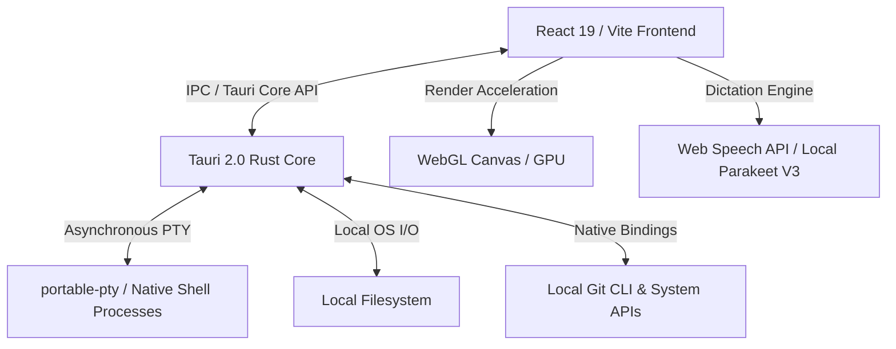

<div align="center">
  

  # Fit
  *The Ultra-Lightweight, High-Performance Agentic Workspace*

  [](LICENSE)
  [](#)
  [](https://tauri.app/)
  [](https://react.dev/)
  [](#)

  ⭐ A high-performance local workspace designed for modern developer focus.

  [Overview](#overview) • [Why Fit?](#why-fit) • [Performance & Size Engineering](#performance--size-engineering) • [Core Capabilities](#core-capabilities) • [System Architecture](#system-architecture) • [Getting Started](#getting-started) • [Configuration & Troubleshooting](#configuration--troubleshooting)
</div>

---

## Overview

**Fit** is an ultra-lightweight, high-performance developer workspace designed to streamline your daily workflow. Inspired by the clean, warm-charcoal aesthetics of modern terminal systems, Fit fuses a hardware-accelerated terminal grid, a zero-lag text editor, native Git integrations, and a live web preview pane into a single, cohesive desktop shell. 

By leveraging native operating system rendering instead of a heavy browser environment, Fit boots instantly and hovers at an idle footprint of **literally ~10 MB of RAM**.

---

## Why Fit?

Modern developers are forced to choose between two extremes:
1. **Feature-Rich Bloat:** IDEs and tools built on Electron (e.g., VS Code, Cursor) that pack full copies of Chromium and Node.js. They routinely consume **300MB to 1GB+ of RAM** just sitting idle, draining battery life and leaving fewer system resources for Docker containers, local compilers, and background processes.
2. **Feature-Sparse Terminals:** Fast, lightweight terminals that lack unified code editing, live previews, side-by-side Git diffing, and intelligent port routing, forcing you to constantly context-switch between windows.

**Fit bridges the gap.** It delivers a fully integrated IDE workspace with the resource footprint of a simple system utility.

### Comparison: How Fit Compares

| Metric / Feature | Fit Workspace | Traditional Electron IDEs | Legacy CLI Terminals |
| :--- | :--- | :--- | :--- |
| **Idle RAM Footprint** | **~10 MB** | 300 MB – 1 GB+ | 15 MB – 50 MB |
| **Startup Overhead** | Near-instantaneous | 2–5+ seconds | Near-instantaneous |
| **Rendering Engine** | Native OS WebView (WebView2/WebKit) | Embedded Chromium | Custom / OS Native |
| **Workspace Layout** | Draggable, split-pane panels | Single/nested editor splits | Manual layout or `tmux` |
| **Embedded Live Preview** | Yes (with automatic port scanner) | Requires extensions / external browser | No |
| **Local Dictation (STT)** | Yes (offline, local audio visualizer) | Often requires external plugins/services | No |
| **Telemetry & Privacy** | 100% Offline & Local | High (telemetry-heavy defaults) | Varies |

---

## Performance & Size Engineering

Fit achieves its hyper-efficient footprint through careful system design and aggressive compiler-level optimization.

### 1. Eliminating the Browser Overhead
Instead of bundling a heavy Chromium distribution, Fit utilizes **Tauri 2.0** to leverage your host operating system's native rendering engine (WebView2 on Windows, WebKit on macOS/Linux). By sharing system graphics APIs and libraries already loaded into memory by the OS, Fit removes hundreds of megabytes of redundant process overhead.

### 2. Rust-Engineered PTY and I/O
The application's core backend is built in Rust. Terminal processes are spawned using `portable-pty` and managed asynchronously using `tokio` thread pools. This guarantees zero blocking operations on the user interface thread, making terminal inputs and directory reads feel completely instantaneous.

### 3. Production Release Profile
To squeeze out every byte of memory and CPU efficiency, the release binary is compiled with a heavily optimized cargo profile:

```toml
[profile.release]
panic = "abort"      # Eliminates code overhead for stack unwinding
codegen-units = 1    # Enables maximum global inter-procedural compiler optimization
lto = true           # Link-Time Optimization (LTO) across all dependencies
opt-level = "s"      # Instructs the compiler to optimize specifically for size
strip = true         # Strips all debug assertions, symbols, and tables
```

---

## Core Capabilities

### 🖥️ Integrated Terminal Grid
* **Multi-Shell Routing:** Native support for system shells on Windows (PowerShell, Cmd, Git Bash, WSL) and macOS/Linux (Bash, Zsh).
* **Hardware-Accelerated Rendering:** Powered by `xterm.js` with **WebGL canvas rendering** for zero-latency screen draws and smooth scrollbacks.
* **Smart Splits:** Drag, resize, and partition terminal grids vertically and horizontally to align with your focus.

### 📝 Precision Code Editing
* **CodeMirror 6 Core:** Syntax-highlighting for TS/JS, HTML, CSS, JSON, Python, Rust, and Markdown.
* **State Management:** Real-time state syncing monitors files changed on disk, automatically indicating dirty/unsaved tabs.
* **Keyboard-Centric Actions:** Familiar command shortcuts, tab expansions, and standard `Ctrl+S` saving operations.

### 🌿 Native Source Control (Git)
* **Status Polling:** Automatic background status checks flag changed, added, and untracked repository files.
* **Visual Diff Viewer:** A high-fidelity side-by-side code diff pane to verify changes before staging.
* **One-Click Actions:** Stage, unstage, discard changes, commit, and sync (fetch, pull, push) directly from the sidebar.

### 🌐 Live Preview & Auto Port Scanner
* **Embedded Browser Pane:** View and test web applications side-by-side with your code editor and terminal instances.
* **Smart Port Detection:** Scans local open ports automatically, identifying running development servers and mapping their framework signatures (Vite, Next.js, Astro, Angular, Python, Jupyter).

### 🎙️ Local Dictation & Speech-to-Text (STT)
* **Hands-Free Coding:** Dictate commands or documentation directly into active text inputs or terminal grids.
* **Parakeet V3 Integration:** Support for the Parakeet V3 language model (456 MB) for fully local, offline voice-to-text conversion.
* **Interactive Equalizer Overlay:** A floating, physics-based audio level visualizer that responds dynamically to volume inputs.
* **Flexible Input Controls:** Configurable hotkeys (defaults to `Control+Space`), push-to-talk toggles, and direct-to-input/clipboard paste options.

### 🌍 Built-In Multi-Language System (i18n)
* **Native Localization:** Complete UI translation layers for English, Italian, Spanish, French, and German.
* **Responsive Layout Adaptation:** Text container layouts adjust seamlessly based on the active language locale.

### 🎨 Warp-Inspired Aesthetics
* **Warm Canvas Tone:** Beautiful `#2b2622` warm charcoal background — selected to reduce eye strain over long coding sessions compared to harsh pure-black screens.
* **Micro-Animations:** Physics-based interactive particle field on the empty workspace landing screen, responding smoothly to cursor coordinates.
* **Editorial Typography:** Clear, modern Inter body typography paired with Instrument Serif italic details for a premium, clean aesthetic.

---

## System Architecture



* **Frontend UI:** Built on React 19, TypeScript, and Vite. Panel management and flexible layout grids are managed natively via `react-resizable-panels`.
* **State Engine:** A global store (`appStore.tsx`) powered by React Context and `useSyncExternalStore` ensuring optimized, selector-driven updates with zero redundant re-renders.
* **Rust Backend:** Bridges front-end actions to native OS system tools, disk I/O, and platform dialog triggers.

---

## Getting Started

### Prerequisites

To build Fit from source, make sure you have the following installed on your machine:
* **Node.js** (v20 or higher)
* **Rust & Cargo** (v1.77 or higher)
* **Git** (installed and added to your system `PATH`)

### Installation

1. Clone the project repository:
   ```bash
   git clone https://github.com/NoCxdee/fit.git
   cd fit
   ```

2. Install the package dependencies:
   ```bash
   npm install
   ```

### Running Locally

To run the frontend in standard Web-only dev mode (using Vite):
```bash
npm run dev
```

To run the full desktop shell inside the Tauri 2.0 developer environment:
```bash
npm run tauri dev
```

> [!NOTE]
> When executing `tauri dev`, Rust compiles the core in debug mode to allow code logging and debugging symbols. The idle RAM footprint will be larger in debug mode. To test the optimized ~10MB RAM limit, build the production release.

### Building for Production

Compile and bundle the production desktop installer:
```bash
npm run build
npm run tauri build
```

The compiled native executable and installer packages will be outputted to `src-tauri/target/release/bundle/`.

---

## Configuration & Troubleshooting

### Local Speech-to-Text Setup
1. Launch Fit and open the **Settings** panel.
2. Select the **Speech** tab.
3. Download the **Parakeet V3** language model (approx. 456 MB).
4. Assign your preferred execution shortcut (e.g., `Control+Space`) and toggle **Push-to-Talk** to fine-tune your dictation behavior.

### Shell Overrides
If Fit fails to spawn a terminal shell (e.g., Git Bash on Windows):
1. Verify that your shell's executable is present in your system environment variable `PATH`.
2. Common paths to check:
   * **PowerShell:** `powershell.exe`
   * **Git Bash:** `C:\Program Files\Git\bin\bash.exe`
   * **WSL:** `wsl.exe`

> [!IMPORTANT]
> **Windows WebView2 Runtime:** Tauri relies on the Microsoft Edge WebView2 runtime. While this is pre-installed on Windows 10 and 11, developers using Windows Server environments may need to download the runtime manually from the official Microsoft site.
